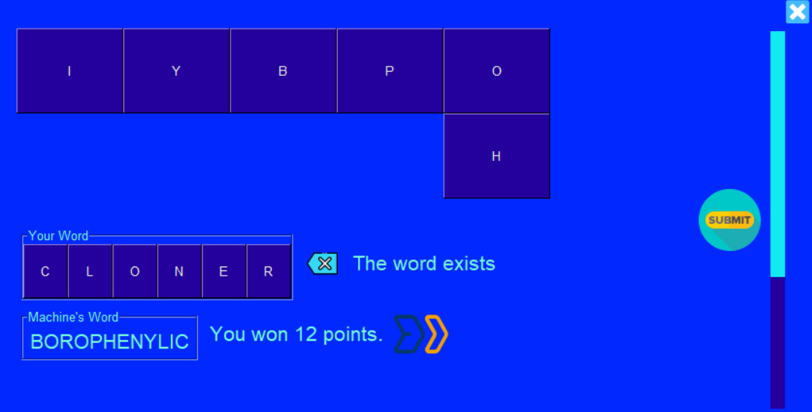

# SLAGALICA QUIZ SHOW

To play please install PySimpleGUI,download the repo and run main.py

Working login database,tutorial window,first game with a database...

CLOSE PIC:
<a href="https://www.flaticon.com/free-icons/close" title="close icons">Close icons created by riajulislam - Flaticon</a>
BACKSPACE:
<a href="https://www.flaticon.com/free-icons/backspace" title="backspace icons">Backspace icons created by Freepik - Flaticon</a>
SUBMIT:
<a href="https://www.flaticon.com/free-icons/submit" title="submit icons">Submit icons created by Freepik - Flaticon</a>
CONTINUE:
<a href="https://www.flaticon.com/free-icons/continue" title="continue icons">Continue icons created by AriqStock - Flaticon</a>

The logo is the official Slagalica TV-show logo,all rights for the logo and the idea go to RTS. https://www.rts.rs/sr/index.html